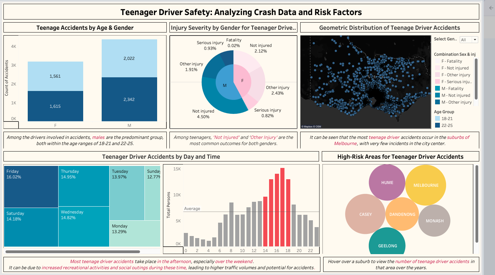
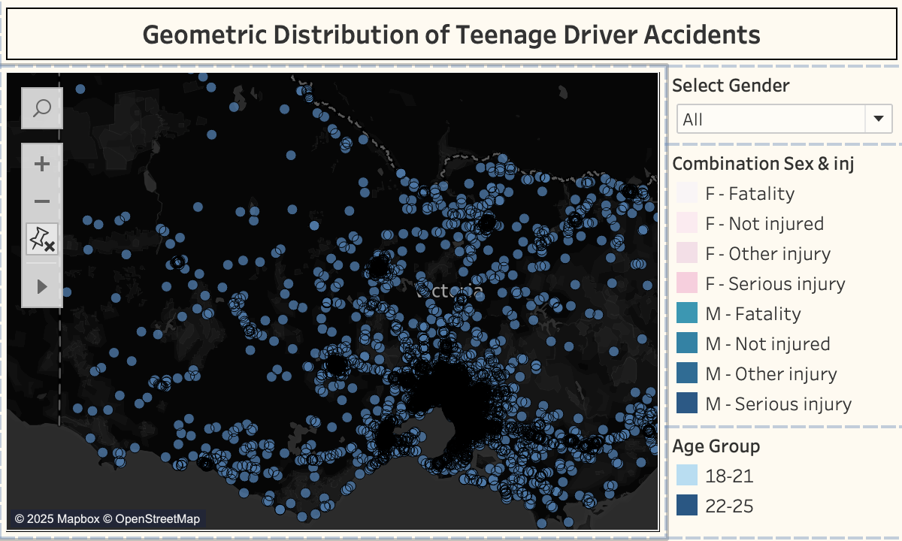

# Teenage Driver Crash Analysis Dashboard – Tableau Project

## Overview

This project involves creating a comprehensive Tableau dashboard to analyze road crash data involving teenage drivers in Victoria. The goal is to help VicRoads, the government agency responsible for road safety, reduce the social cost of road crashes through data-driven insights and actionable recommendations.

The dashboard focuses on understanding patterns and risk factors that contribute to teenage driver accidents, providing insights into vulnerable groups, high-risk areas, time of day, and injury severity. The visualization leverages both spatial (geographical) and temporal (time-based) data to offer a holistic view of the issue.

### Key Visualizations:
1. **Teenage Accidents by Age & Gender** – A stacked bar chart showing the distribution of crashes by age group and gender.
2. **Injury Severity by Gender** – A nested pie chart illustrating the relationship between gender and injury severity for teenage drivers.
3. **Geometric Distribution of Teenage Drivers** – A heat map displaying the concentration of teenage driver accidents across different locations in Victoria.
4. **Teenager Driver Accidents by Day** – A rectangular block (heat map-style) visualization showing crash frequency by day of the week.
5. **Teenager Driver Accidents by Time** – A bar chart visualizing the number of crashes during different times of the day.
6. **High-Risk Areas for Teenage Driver Accidents** – A bubble chart identifying accident hotspots for teenage drivers based on frequency and severity.

## Purpose
The purpose of this dashboard is to support VicRoads in identifying patterns and contributing factors to teenage driver accidents, enabling the development of targeted interventions. By visualizing factors such as accident time, location, and injury severity, VicRoads can make data-backed decisions to reduce crashes and improve road safety.

## Tools & Technologies
- **Data Visualization**: Tableau
- **Data Sources**: Road crash data for Victoria, including various attributes such as accident details, vehicle information, weather conditions, etc.
- **File Format**: Tableau Packaged Workbook (.twbx)

## Data Sources
The datasets used in this project are stored in the `datasets` folder, and the files include:

- `ACCIDENT.csv`: Information on accidents, including accident type and severity.
- `ACCIDENT_EVENT.csv`: Data about the specific events that contributed to the accidents.
- `ACCIDENT_LOCATION.csv`: Geographical data about the accident locations.
- `ATMOSPHERIC_COND.csv`: Weather-related data for accident events.
- `ROAD_SURFACE_COND.csv`: Data related to road surface conditions at the time of the accident.
- `SUB_DCA.csv`: Details about accident categories and conditions.
- `PERSON.csv`: Data about the individuals involved in the accidents, including age, gender, and injury levels.

You can explore the dataset by opening the `.twbx` file in Tableau.

## Interactive Features
The dashboard offers several interactive features:
- **Filter by Gender**: Users can filter the visualizations to focus on male or female teenage drivers.
- **Tooltip Information**: Hover over any data point to see additional information about individual accidents.
- **Highlight Actions**: Clicking on one visualization highlights related data in other visualizations to provide a deeper understanding of the trends.

## Screenshots
Below are some key screenshots from the dashboard:

_Overall view of the Teenage Driver Safety Dashboard._

_Teenage Accidents by Age & Gender (Bar Chart)._

_Injury Severity by Gender (Pie Chart)._

_Geometric Distribution of Teenage Drivers (Heat Map)._

_Teenager Driver Accidents by Day (Rectangular Block)._

_Teenager Driver Accidents by Time (Bar Chart)._

_High-Risk Areas for Teenage Driver Accidents (Bubble Chart)._

## Installation Instructions
### Prerequisites:
1. **Tableau Desktop or Tableau Public**: Download Tableau from [here](https://www.tableau.com/products/desktop) if you don't have it installed.
2. **Dataset**: All datasets required for this project are included in the `datasets` folder.

### Steps to View the Dashboard:
1. Clone or download this repository to your local machine.
2. Open the `Teenage_Driver_Safety.twbx` file in Tableau Desktop or Tableau Public.
3. Interact with the dashboard:
   - Use filters to explore different data subsets.
   - Hover over data points to view tooltips with additional information.
   - Click on visualizations to highlight related data in other sections of the dashboard.

## Conclusion
This project demonstrates the use of data visualization to analyze complex data sets and uncover actionable insights for improving road safety. The dashboard created offers a clear and interactive way to explore key factors contributing to teenage driver accidents and can serve as a tool for data-driven decision-making.
